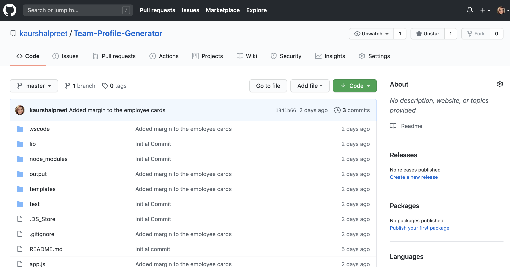

# Team-Profile-Generator

## Description

The Team Profile Generator is a command-line input application that requests user for the team information about the members of the engineering team and generates an HTML webpage displaying the summaries for each person provinding a quick access to the email address and GitHub profiles.
 
You can also find a walkthrough video that demonstrates the functionality of the application [here](https://drive.google.com/file/d/1z-xdAMBtgOCZ2XQsRnVl3nBv2Jvp3HGF/view?usp=sharing)

[The Link to My Github Repository](https://github.com/kaurshalpreet/Team-Profile-Generator)

---

## Table of Contents

1. [Installation](#Installation)
1. [Usage](#Usage)
1. [Credits](#Credits)
1. [License](#License)

---

## Installation

npm install  
npm jest  
npm install inquirer  

---

## Usage

Your app will run as a Node CLI to gather information about each employee. You need to open app.js in integrated terminal and type "node app.js" and prompts to enter your input will appear. The user can input any number of team members, and they may be mix of engineers and interns.  

A screenshot showing the user input is shown below.

When the user has completed building the team, the application will create an HTML file that displays the nicely formatted team roster based on the information provided by the user.

A screenshot of output HTML webpage is shown below.

---

## Credits

- UC Davis BootCamp - Instructors and TAs
- https://www.w3schools.com/
- https://www.youtube.com/
- https://www.google.com/
- https://www.npmjs.com/package/inquirer
- https://choosealicense.com/licenses/
- https://shields.io/category/license

---

## License

#### This application is licensed under the [MIT License](https://opensource.org/licenses/MIT)

---

## Test

Jest is used to perform tests on all the class constructors to ensure that they behave as expected.

---

## Questions

#### You can reach me via my [Github](https://github.com/kaurshalpreet) account.

#### Email me with any additional questions at: kaurshalpreet@gmail.com

---
